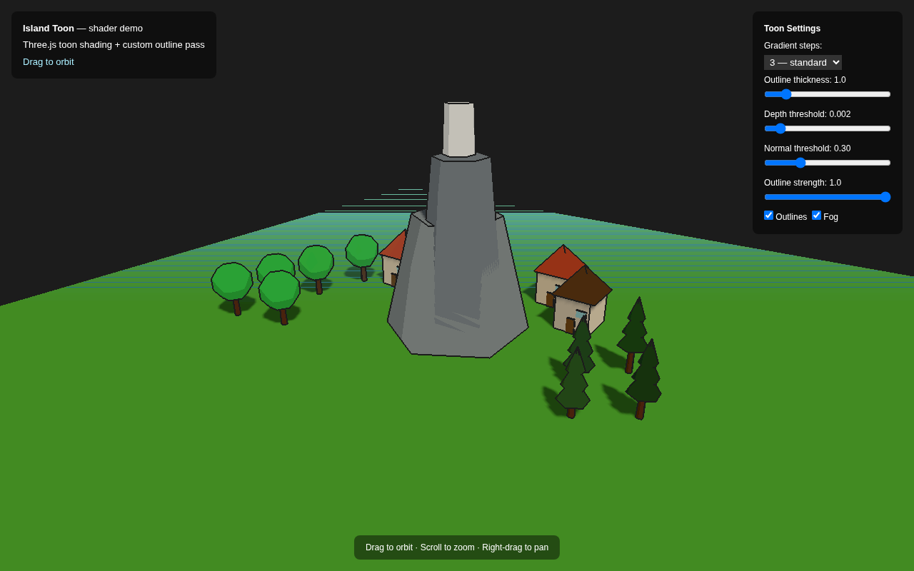

1|# island-toon
2|
3|Toon shading + cel outline post-processing for [Island Voxel Engine](https://github.com/Caddickbrown/Island-Voxel). Designed to be imported as ES modules — no bundler required.
4|
5|Inspired by the visual style of [messenger.abeto.co](https://messenger.abeto.co/).


6|
7|## What's in here
8|
9|| File | What it does |
10||------|-------------|
11|| `src/gradient.js` | Creates `DataTexture` gradient maps for `MeshToonMaterial` |
12|| `src/toon-material.js` | Cached toon material factory (replaces `MeshStandardMaterial`) |
13|| `src/normal-pass.js` | Renders the scene to a normal G-buffer for edge detection |
14|| `src/outline-pass.js` | Custom `ShaderMaterial` pass: depth + normal edge detection |
15|| `src/composer.js` | Wires up `EffectComposer`: RenderPass → OutlinePass → OutputPass |
16|| `demo.html` | Live demo with tunable sliders |
17|
18|## How the outline works
19|
20|Three.js's built-in `OutlinePass` only catches silhouette edges (outer object boundaries) via stencil dilation. It misses interior edges — the corners of window recesses, roofline details, tree trunk ridges.
21|
22|This custom pass samples both **depth** and **normals** at 4 neighbouring pixels:
23|
24|- **Depth discontinuity** → silhouette (object boundary)
25|- **Normal discontinuity** → surface detail (corner, window recess, etc.)
26|
27|Both are composited into a single edge mask applied in one shader pass.
28|
29|## Quick start — demo
30|
31|```bash
32|cd island-toon
33|python3 -m http.server 8910
34|# open http://localhost:8910/demo.html
35|```
36|
37|Use the sliders to tune outline thickness, depth/normal thresholds, and gradient step count live.
38|
39|## Integration into Island Voxel Engine
40|
41|### 1. Replace chunk material in `engine/renderer.js`
42|
43|```js
44|import { toonMaterialFor } from '../../island-toon/src/toon-material.js';
45|import { GRAD3 } from '../../island-toon/src/gradient.js';
46|
47|// Instead of:
48|// mesh.material = new THREE.MeshStandardMaterial({ color: ... });
49|
50|// Use:
51|mesh.material = toonMaterialFor(VCOLOR[chunkPrimaryType], GRAD3);
52|```
53|
54|`MeshToonMaterial` does **not** use `roughness` or `metalness` — remove those if present.
55|
56|### 2. Replace the renderer call in `index.html` / game loop
57|
58|```js
59|import { createComposer, renderFrame } from '../../island-toon/src/composer.js';
60|
61|// Setup (once):
62|const { composer, normalTarget, outlinePass } = createComposer(renderer, scene, camera, {
63|  outlineColor:    0x1a1a1a,  // dark outline
64|  outlineThickness: 1.0,
65|  depthThreshold:  0.002,
66|  normalThreshold: 0.3,
67|});
68|
69|// Each frame instead of renderer.render(scene, camera):
70|renderFrame(renderer, composer, scene, camera, normalTarget);
71|```
72|
73|### 3. Fog to match sky colour
74|
75|```js
76|const SKY = 0x7ed6cb;
77|scene.fog = new THREE.Fog(SKY, 60, 180);
78|scene.background = new THREE.Color(SKY);
79|```
80|
81|## Tuning guide
82|
83|| Parameter | Low | High | Effect |
84||-----------|-----|------|--------|
85|| Gradient steps | 2 | 4 | 2 = harsh graphic, 4 = softer toon |
86|| Depth threshold | 0.0005 | 0.01 | Lower = more depth edges (can be noisy) |
87|| Normal threshold | 0.1 | 0.8 | Lower = more surface detail edges |
88|| Thickness | 0.5 | 3.0 | Outline width in pixels |
89|| Strength | 0 | 1 | Fade outlines in/out |
90|
91|## Known pitfalls
92|
93|- `gradientMap` **must** use `NearestFilter` — linear filtering blurs the steps
94|- `MeshToonMaterial` ignores `roughness`/`metalness` — it's not PBR
95|- The normal pass uses `scene.overrideMaterial` — any object with transparent or custom material will render normals incorrectly. Either skip those objects or handle them separately
96|- Water plane looks good without toon (use a `ShaderMaterial` for animated water, not `MeshToonMaterial`)
97|- Three.js r162+ required (`DepthTexture` on `WebGLRenderTarget`)
98|
99|## Three.js version
100|
101|Targets Three.js **r162+** (what Island Voxel uses). Demo loads r180 from jsDelivr.
102|